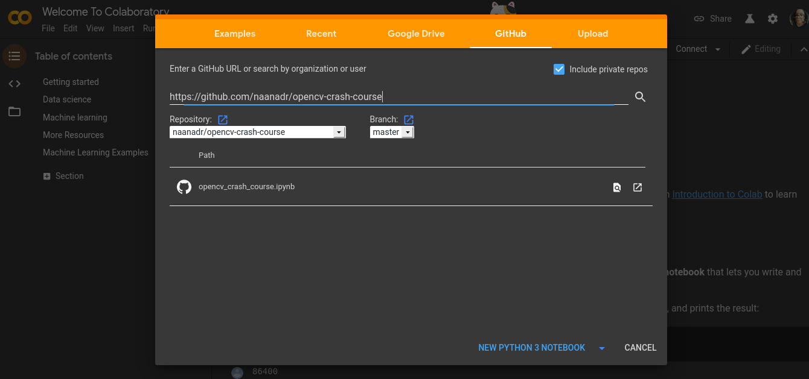

# opencv-crash-course
Introdução a OpenCV e à alguns conceitos de processamento de imagem e visão computacional.

Para visualizar e executar o [notebook](https://github.com/naanadr/opencv-crash-course/blob/master/opencv_crash_course.ipynb) desse "curso rapidinho", vamos utilizar o [GoogleColab](https://colab.research.google.com/).

## Caso você não saiba o que é o GoogleColab
 
 O Google Colaboratory (ou Colab) é um ambiente fornecido de forma gratuíta pelo Google que possibilita você executar, editar e criar notebooks Jupyter. Esse ambiente já vem configurado com o Python e algumas bibliotecas (como o OpenCV e Numpy), não precisando que seja realizado algum tipo de configuração (como o pip install ...).
 
 Para abrir o [notebook](https://github.com/naanadr/opencv-crash-course/blob/master/opencv_crash_course.ipynb), você precisará ir em *File* -> *Open Notebook*. Após isso selecione *GitHub* e insira a url *https://github.com/naanadr/opencv-crash-course* como na figura a baixo:

## Dúvidas e sugestões

Entre em contato comigo abrindo uma issue ou pelo Telegram @Naanadr . 

